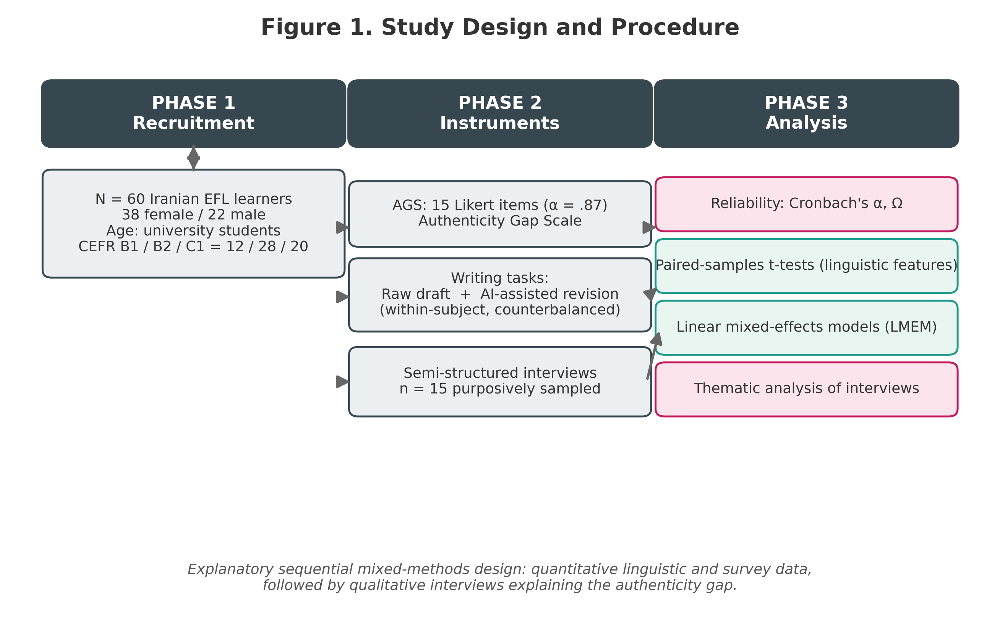

# Generative AI, Linguistic Identity, and the Authenticity Gap in AI-Assisted EFL Writing

[](https://doi.org/10.5281/zenodo.21821502)
[](https://opensource.org/licenses/MIT)
[](https://www.python.org/)
[](https://www.r-project.org/)

---

## 📌 Overview & Graphical Abstract

This repository contains the empirical datasets, reproducible computational pipelines, and psychometric instruments for the research project:  
**"Generative AI, Linguistic Identity, and the Authenticity Gap in AI-Assisted EFL Writing"**.

Employing an explanatory sequential mixed-methods design ($\text{QUAN} \rightarrow \text{QUAL}$), this study examines the paradox between automated surface correction and the erosion of authorial stance/voice among EFL writers ($N=60$ quantitative, $n=15$ qualitative) using GenAI (GPT-4o).

<p align="center">
  
</p>

---

## 👤 Author & Contact Information

* **Lead Researcher:** Dr. Pegah Merrikhi
* **Role:** Independent Researcher | PhD in Applied Linguistics / TESOL
* **Email:** [Pegah.merrikhiii@gmail.com](mailto:Pegah.merrikhiii@gmail.com)
* **Permanent DOI Archive:** [10.5281/zenodo.21821502](https://doi.org/10.5281/zenodo.21821502)

---

## 🔬 Research Design & Methodology

The empirical protocol consists of two distinct phases:
1. **Quantitative Phase:** Paired textual analysis ($N=60$ pre- vs. post-AI essays) evaluating structural errors, stance markers, and psychometric validation of the **Authenticity Gap Scale (AGS)** ($\alpha = .87$).
2. **Qualitative Phase:** In-depth semi-structured interviews ($n=15$) exploring phenomenological experiences of voice loss and reliance.

<p align="center">
  
</p>

---

## 📊 Summary of Key Empirical Results

### 1. Linguistic Trade-Offs (Pre-AI vs. Post-AI Revision)

Generative AI achieves near-total elimination of mechanical surface errors, but causes a severe, statistically significant erosion in authorial stance, hedging, and self-mention:

| Linguistic Dimension | Pre-AI Mean (SD) | Post-AI Mean (SD) | Net Change | Effect Size (*Cohen's d*) | *p*-value |
| :--- | :---: | :---: | :---: | :---: | :---: |
| **Grammar / Mechanical Errors** | 14.82 (4.15) | 2.12 (1.05) | **-85.7%** | $d = 3.82$ | $p < .001$ |
| **Hedges (Epistemic Stance)** | 11.45 (3.20) | 3.71 (1.42) | **-67.6%** | $d = 2.94$ | $p < .001$ |
| **Boosters (Certainty Markers)** | 7.30 (2.10) | 2.45 (1.18) | **-66.4%** | $d = 2.78$ | $p < .001$ |
| **Self-Mention (*I, My, We*)** | 5.85 (1.95) | 1.10 (0.82) | **-81.2%** | $d = 3.05$ | $p < .001$ |
| **Lexical Diversity (TTR)** | 0.48 (0.05) | 0.59 (0.04) | **+22.9%** | $d = 2.35$ | $p < .001$ |

<p align="center">
  
</p>

---

### 2. Psychometric Scale & Demographics (AGS)

Scores on the **Authenticity Gap Scale (AGS)** revealed that perceived text ownership drops substantially as AI intervention increases, especially among intermediate writers who lack the agency to resist algorithmic homogenization:

<p align="center">
  
</p>

<p align="center">
  
</p>

---

### 3. Qualitative Thematic Matrix (Joint Display)

| Core Theme | Quantitative Finding | Exemplary Qualitative Evidence | Theoretical Interpretation |
| :--- | :--- | :--- | :--- |
| **Loss of Personal Voice** | AGS Mean = 4.88 / 7.0; Stance markers dropped 67.6%. | *"The grammar is impeccable, but it does not sound like me. My personal voice was scrubbed clean."* (P12) | **Voice Laundering**: Erasure of idiosyncratic expression to fit standardized native-speaker norms. |
| **AI-Crutch Paradox** | High perceived quality (5.6/7) vs. low revision ownership (2.9/7). | *"I feel I cannot write without it anymore. It's a crutch I resent yet rely on."* (P07) | **Learner Atrophy**: Cognitive deference leading to diminished writing self-efficacy. |
| **Confidence–Authenticity Tension** | Strong negative correlation ($r = -.58$) between accuracy and self-identification. | *"I got an A on this paper, but I felt like an imposter reading it out loud."* (P29) | **Authenticity Dilemma**: Superficial academic validation at the expense of authorial agency. |

---

## 🎯 Conclusion & Pedagogical Implications

1. **Voice-Preserving AI Literacy:** Writing instruction must shift from technical prompt crafting to critical revision competence. Learners need clear strategies to preserve hedges and identity markers when negotiating AI edits.
2. **Hybrid Revision Protocols:** Classrooms should adopt multi-draft frameworks with mandatory reflection logs where students justify why specific AI revisions were accepted, rejected, or modified.
3. **Reforming Writing Assessment:** Evaluation rubrics that only reward surface fluency inadvertently incentivize complete linguistic outsourcing. Rubrics must assign credit to authorial voice, positionality, and multilingual identity.

---

## 📁 Repository Structure
```text
├── Figures/
│   ├── graphical_abstract.png
│   ├── figure1_methodology.png
│   ├── figure2_results_demographics_ags.png
│   ├── py_plot_linguistic_boxplots.png
│   ├── py_plot_ags_distribution.png
│   └── gitkeep
├── github_data_repo/
│   ├── ags_survey_items.csv
│   ├── linguistic_features_120.csv
│   ├── interview_codes_n15.csv
│   ├── lmem_results_t5.csv
│   ├── 01_eda_and_reliability.py
│   ├── 02_linguistic_analysis_ttests.py
│   ├── 03_lmem_analysis.R
│   └── master_analysis.ipynb
└── README.md
---
📜 Citation
bibtex
@misc{merrikhi_2026_zenodo21821502,
  author       = {Merrikhi, Pegah},
  title        = {{Generative AI, Linguistic Identity, and the Authenticity 
                   Gap in AI-Assisted EFL Writing: Complete Empirical Repository}},
  year         = {2026},
  publisher    = {Zenodo},
  doi          = {10.5281/zenodo.21
---
