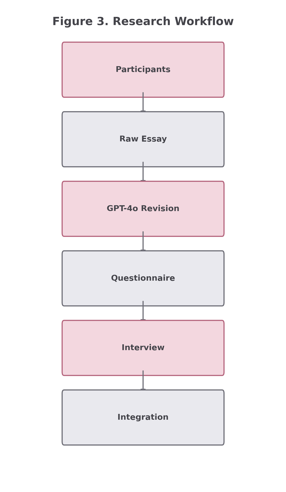
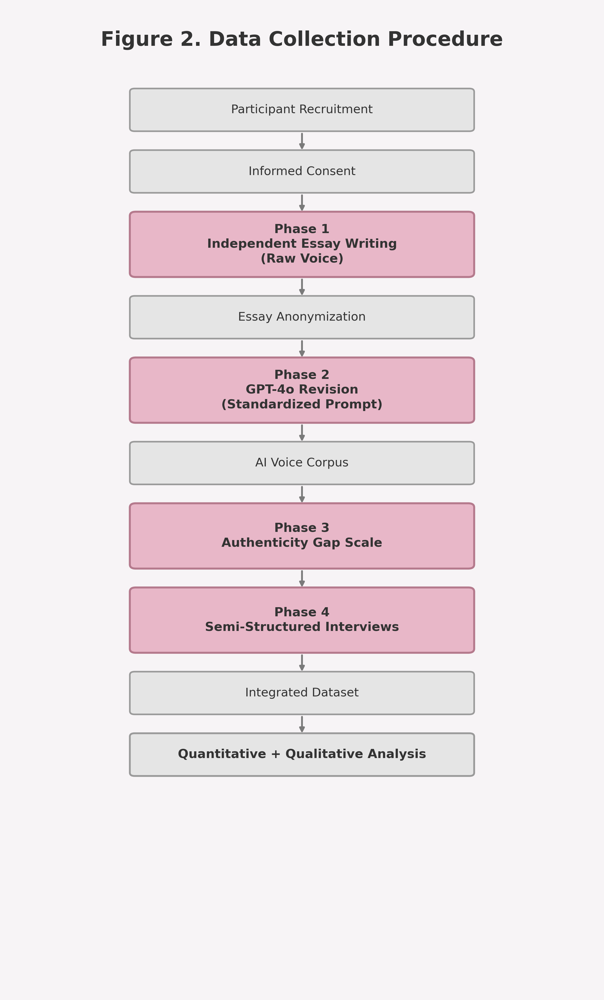
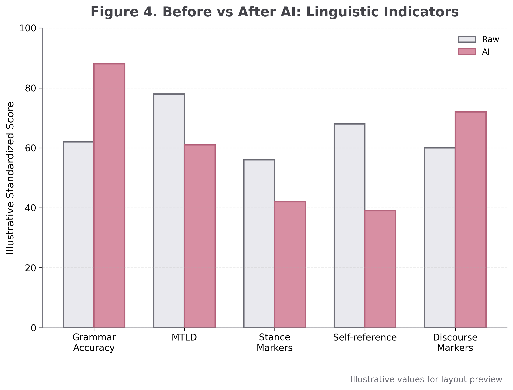

# 🎓 Language Education in a Brave New World
### *Generative AI, Linguistic Identity, and the Authenticity Gap in AI-Assisted EFL Writing*

**Author:** Prof. Pegah Marikhi | 📧 [Pegah.merrikhiii@gmail.com](mailto:Pegah.merrikhiii@gmail.com) | 📅 July 2026

<h2>Graphical Abstract</h2>

  

  <em>Figure 1. Conceptual framework of the “Authenticity Gap” in AI-assisted EFL writing.</em>

## 📖 Study Overview
This high-impact mixed-methods study investigates the psychological and linguistic shift in advanced EFL learners (N=60) when using **GPT-4o** for writing revisions. We examine the tension between linguistic perfection and the learner's **authentic linguistic identity**.

### 🎯 Key Research Pillars
| 🧪 Linguistic Analysis | 🧠 Psychological Impact | 🗣️ Qualitative Depth |
| :--- | :--- | :--- |
| Raw Voice $\rightarrow$ AI-Revised | Authenticity Gap Scale (AGS) | Semi-structured Interviews |
| Complexity & Accuracy Metrics | Identity Compression | Thematic Coding (n=15) |

---

## 🛠️ Research Architecture

*Figure 2: End-to-end pipeline of data collection and analysis.*

---

## 📂 Data Repository & Access

### 📊 The Master Dataset
The complete data package is stored in: `📂 /data/processed/brave world Research_Data_Complete.xlsx`

**Detailed Workbook Structure:**
- **Core Data:** `Participants`, `Linguistic_Features`, `LMEM_Data`
- **Psychometric Scales:** `AGS_Items`, `AGS_Subscales`
- **Qualitative:** `Interview_Codes`
- **Documentation:** `README`, `Codebook`

### 📉 Critical Visualizations

#### 🟢 Data Collection Procedure

#### 🔵 Performance Analysis (Before vs. After AI)

---

## ⚙️ Technical Specifications
- **Analysis Suite:** `R` (LME4 package) & `SPSS`
- **Data Framework:** Linear Mixed-Effects Models (LMEM)
- **DOI:** `[Pending / To be added]`

---
*This research is conducted under strict ethical guidelines for participant anonymity and data privacy.*
