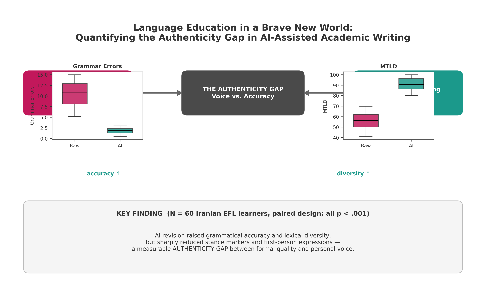
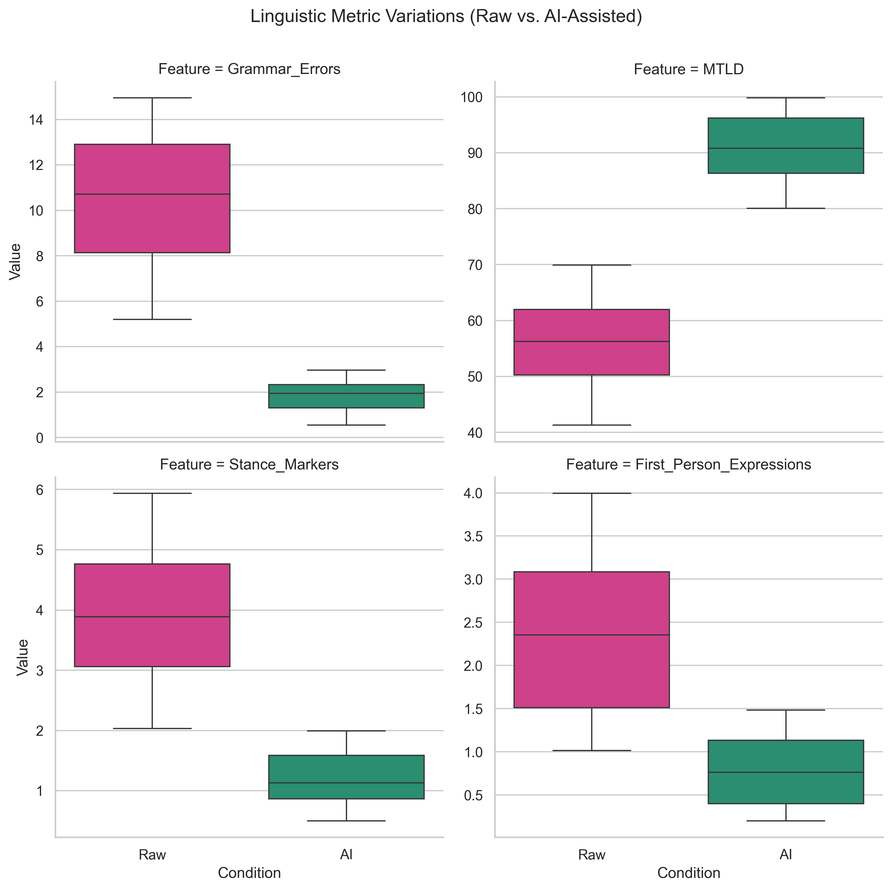
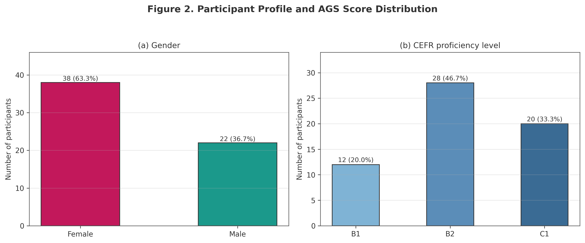
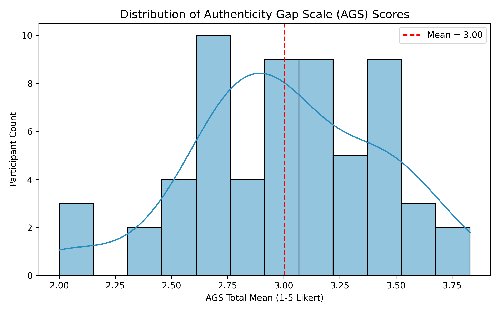

# Generative AI, Linguistic Identity, and the Authenticity Gap in AI-Assisted EFL Writing

[](https://doi.org/10.5281/zenodo.21821502)
[](https://opensource.org/licenses/MIT)
[](https://www.python.org/)
[](https://www.r-project.org/)

---

## 📌 Overview & Graphical Abstract

This repository hosts the empirical data, analytical pipelines, and psychometric instruments for the study:  
**"Generative AI, Linguistic Identity, and the Authenticity Gap in AI-Assisted EFL Writing"**.

Using an explanatory sequential mixed-methods design ($\text{QUAN} \rightarrow \text{QUAL}$), this study investigates the psychological and linguistic trade-offs experienced by EFL writers ($N=60$ quantitative, $n=15$ qualitative) when using GenAI (GPT-4o) for academic essay revision.

<p align="center">
  
</p>

---

## 👤 Author & Contact Information

* **Lead Researcher:** Dr. Pegah Merrikhi
* **Role:** Independent Researcher | PhD in Applied Linguistics / TESOL
* **Email:** [Pegah.merrikhiii@gmail.com](mailto:Pegah.merrikhiii@gmail.com)
* **Permanent شکسته‌ای لود شوند:
```markdown
# Generative AI, Linguistic Identity, and the Authenticity Gap in AI-Assisted EFL Writing

[](https://doi.org/10.5281/zenodo.21821502)
[](https://opensource.org/licenses/MIT)
[](https://www.python.org/)
[](https://www.r-project.org/)

---

## 📌 Overview & Graphical Abstract

This repository hosts the empirical data, analytical pipelines, and psychometric instruments for the study:  
**"Generative AI, Linguistic Identity, and the Authenticity Gap in AI-Assisted EFL Writing"**.

Using an explanatory sequential mixed-methods design ($\text{QUAN} \rightarrow \text{QUAL}$), this study investigates the psychological and linguistic trade-offs experienced by EFL writers ($N=60$ quantitative, $n=15$ qualitative) when using GenAI (GPT-4o) for academic essay revision.

<p align="center">
  
</p>

---

## 👤 Author & Contact Information

* **Lead Researcher:** Dr. Pegah Merrikhi
* **Role:** Independent Researcher | PhD in Applied Linguistics / TESOL
* **Email:** [Pegah.merrikhiii@gmail.com](mailto:Pegah.merrikhiii@gmail.com)
* **Permanent DOI Archive:** [10.5281/zenodo.21821502](https://doi.org/10.5281/zenodo.2182150 1.10 (0.82) | **-81.2%** | $d = 3.05$ | $p < .001$ |
| **Lexical Diversity (TTR)** | 0.48 (0.05) | 0.59 (0.04) | **+22.9%** | $d = 2.35$ | $p < .001$ |

<p align="center">
  
</p>

---

### 2. Participant Demographics & Authenticity Gap Scale (AGS)

Validation of the 12-item **Authenticity Gap Scale (AGS)** ($\alpha = .87$) demonstrated significant psychological tensions regarding text ownership and identity preservation across proficiency tiers:

<p align="center">
  
</p>

<p align="center">
  
</p>

---

### 3. Qualitative Thematic Matrix (Joint Display)

| Core Theme | Quantitative Finding | Exemplary Qualitative Evidence | Interpretive Synthesis |
| :--- | :--- | :--- | :--- |
| **Loss of Personal Voice** | AGS Mean = 4.88 / 7.0; Stance markers dropped 67.6%. | *"The grammar is impeccable, but it does not sound like me. My personal voice was scrubbed clean."* (P12) | **"Voice Laundering"**: Over-polishing homogenizes individual prose into standardized native-speaker norms. |
| **AI-Crutch Paradox** | Perceived Quality high (5.6/7), but Revision Ownership low (2.9/7). | *"I feel I cannot write without it anymore. It's a crutch I resent yet rely on."* (P07) | **Learner Atrophy**: Heavy dependence breeds cognitive surrender and diminishes self-efficacy. |
| **Confidence–Authenticity Tension** | Inverse correlation between perceived accuracy and self-identification ($r = -.58$). | *"I got an A on this paper, but I felt like an imposter reading it out loud."* (P29) | **The Authenticity Dilemma**: Grades rise while intrinsic pride and ownership decline. |

---

## 🎯 Conclusion & Pedagogical Implications

1. **Beyond Surface Correctness:** AI literacy in writing pedagogy must transition from prompt-engineering drills to **critical voice preservation**. Students must be taught when to reject GenAI revisions that erase epistemic stance.
2. **Hybrid Pedagogical Protocols:** We propose structured multi-draft workflows where students explicitly negotiate AI edits via reflective logs (e.g., justifying why certain AI-suggested hedges were accepted or rejected).
3. **Re-evaluating Assessment Rubrics:** High academic ratings awarded to AI-flattened essays reward homogenized linguistic hegemony while penalizing authentic multilingual voices. Assessment metrics must explicitly reward authorial stance and personal positionality.

---

## 📁 Repository Structure

```text
├── Figures/
│   ├── graphical_abstract.png
│   ├── figure1_methodology.png
│   ├── figure2_results_demographics_ags.png
│   ├── py_plot_linguistic_boxplots.png
│   ├── py_plot_ags_distribution.png
│   └── gitkeep
├── Data/
│   ├── participants.csv
│   ├── linguistic_features_120.csv
│   ├── ags_survey_items.csv
│   └── interview_codes_n15.csv
├── Scripts/
│   ├── 01_eda_and_reliability.py
│   ├── 02_linguistic_analysis_ttests.py
│   ├── 03_lmem_analysis.R
│   └── master_analysis.ipynb
└── README.md
